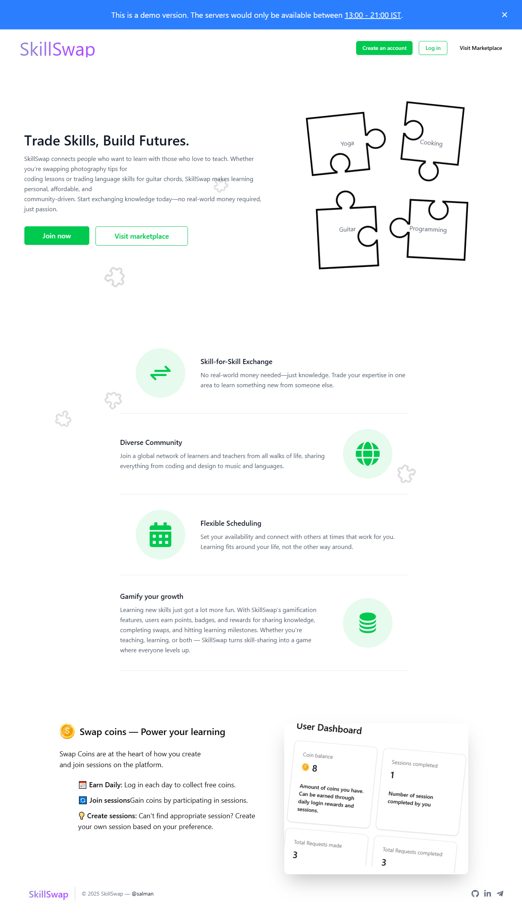

# 🎯 Skillswap – _Trade Skills, Build Future_

**Skillswap** is a full-stack web application built to demonstrate my ability to design, develop, and deliver scalable, type-safe, and user-focused software.

The platform enables users to **offer skills** they know (like coding, music, or art) and **learn skills** from others in return — no money involved, just time. It’s a barter-style learning ecosystem that blends social interaction, scheduling, and real-time communication.

> 🚀 Built to showcase my expertise in TypeScript, secure authentication, scalable architecture, and real-world user experience design.

---

## 🧩 Project Purpose

This project was created as a **technical portfolio piece** to demonstrate:

- Full-stack application design
- Secure, token-based authentication
- Real-time communication with WebSockets
- Type-safe development with **TypeScript**
- Clean UI/UX logic, routing, and dynamic rendering
- REST API design and integration
- Scalable modular code organization

---

## ✨ Key Features

✅ **End-to-End Type Safety**

- TypeScript across both frontend and backend
- Strict typing for routes, APIs, and shared models

🔐 **Secure Authentication Flow**

- JWT-based login with access & refresh tokens
- Role-based route protection & session handling

🔍 **Skill Search & Filtering**

- Filter users by skills offered and availability
- Responsive, intuitive search interface

📅 **Booking System with Calendar Integration**

- Availability-based scheduling
- Integrated calendar view

💬 **Real-Time Chat (Socket.IO)**

- One-to-one messaging system
- Session-based, persistent chat rooms

🌟 **Rating & Review System**

- Leave structured feedback after sessions
- Builds trust and transparency among users

👤 **Dynamic User Profiles**

- Skills offered, skills wanted, bios, and availability
- Fully dynamic and editable

---

## 🛠 Tech Stack

| Category        | Technology                                           |
| --------------- | ---------------------------------------------------- |
| Language        | TypeScript                                           |
| Frontend        | React, Redux, Redux Toolkit, Tailwind CSS, Shadcn UI |
| Backend         | Node.js + Express                                    |
| Real-time Comm. | Socket.IO                                            |
| Auth            | JWT (access & refresh tokens)                        |
| Database        | Prisma, MongoDB                                      |
| Styling         | Tailwind CSS                                         |

---

## 🧰 Setup & Run Locally

### Prerequisites

- Node.js
- `npm`
- MongoDB instance (or any other db supported by Prisma)

### Installation

```bash
git clone https://github.com/salman9802/SkillSwap.git
cd SkillSwap
npm install:all
```

### Environment Variables

Create a `.env` file in the root according to `.env.example`.

Here’s a breakdown of what each variable in the `.env` file does:

| Variable               | Description                                                                |
| ---------------------- | -------------------------------------------------------------------------- |
| `ACCESS_TOKEN_SECRET`  | Secret used to sign and verify JWT access tokens.                          |
| `COOKIE_SECRET`        | A secret key used to sign cookies (for secure cookie-based sessions).      |
| `DATABASE_URL`         | MongoDB connection string (e.g., from MongoDB Atlas).                      |
| `NODE_ENV`             | Set to `"development"` during development or `"production"` when deployed. |
| `PORT`                 | Port number for server                                                     |
| `REFRESH_TOKEN_SECRET` | Secret used to sign and verify JWT refresh tokens.                         |
| `SERVER_BASE_URL`      | URL for server (used by client. eg. `http://localhost`)                    |

### Start the App

```bash
# both server and client
npm run dev:user

# only server
npm run dev:server

# only client
npm run dev:userclient
```

---

## 📸 Screenshots



---

## 🧠 What I Learned

This project helped me strengthen my understanding of:

- **TypeScript-first development** for both frontend and backend
- Secure authentication using JWT best practices
- Real-time client-server communication (WebSockets)
- Booking logic & calendar state management
- Creating full-featured, scalable full-stack app

---

## 📬 Contact Me

Feel free to connect if you're interested in discussing the project or opportunities.

- **[Email](mailto:khansalmanayaz@gmail.com)**
- **[LinkedIn](https://www.linkedin.com/in/salman9802/)**
- **[Portfolio](https://salman9802.github.io/Portfolio/)**

---

## 📄 License

This project is for demonstration purposes only. It may not be copied, modified, or distributed without explicit permission. You are free to execute and evaluate the code for the purposes of professional evaluation or an interview process. However, it may not be repurposed or used as part of anyone else's portfolio or resume.

See [NOTICE](./NOTICE.md) for open-source components and their respective licenses.
